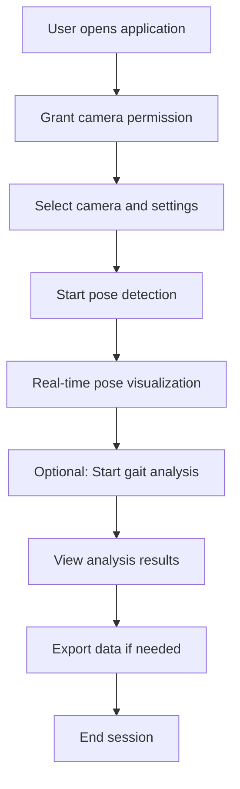
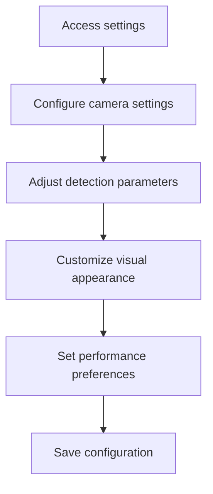
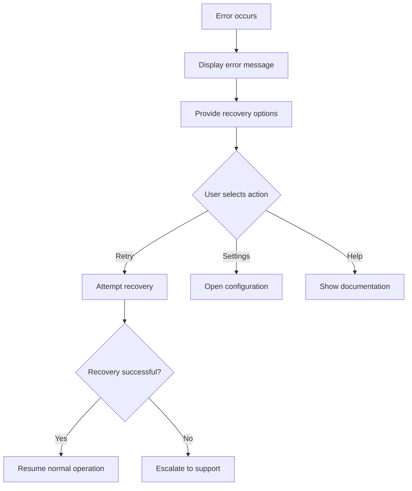

# Functional Requirements - Phase 1 Specifications

## 🎯 Core Functional Requirements

### FR-001: Real-Time Pose Detection
**Priority**: Critical  
**Description**: The system shall detect human poses from webcam video streams in real-time.

**Acceptance Criteria**:
- [ ] System detects 17-keypoint pose structure (COCO format)
- [ ] Maintains minimum 30 FPS pose detection rate
- [ ] Achieves >90% keypoint detection accuracy under good lighting
- [ ] Handles single person detection reliably
- [ ] Provides confidence scores for each detected keypoint
- [ ] Operates without external server dependencies

**Dependencies**: Camera Service, TensorFlow.js, MoveNet Model

### FR-002: Camera Integration
**Priority**: Critical  
**Description**: The system shall access and manage webcam video streams.

**Acceptance Criteria**:
- [ ] Requests appropriate camera permissions
- [ ] Handles permission denial gracefully
- [ ] Supports multiple camera selection
- [ ] Provides camera resolution configuration (720p, 1080p)
- [ ] Handles camera connection/disconnection events
- [ ] Displays camera feed with minimal latency (<100ms)

**Dependencies**: Browser MediaDevices API, Camera Service

### FR-003: Gait Analysis
**Priority**: High  
**Description**: The system shall analyze walking patterns and gait characteristics.

**Acceptance Criteria**:
- [ ] Detects gait cycles (heel strike to heel strike)
- [ ] Calculates stride length and frequency
- [ ] Measures left/right leg symmetry
- [ ] Identifies stance and swing phases
- [ ] Tracks temporal gait parameters
- [ ] Generates gait analysis reports

**Dependencies**: Pose Detection Service, Gait Analysis Service

### FR-004: Visual Feedback
**Priority**: High  
**Description**: The system shall provide real-time visual feedback of pose detection.

**Acceptance Criteria**:
- [ ] Overlays skeleton structure on video feed
- [ ] Displays keypoint connections with appropriate colors
- [ ] Shows confidence indicators for pose quality
- [ ] Renders motion trails for movement visualization
- [ ] Updates visualization at minimum 30 FPS
- [ ] Provides customizable visual settings

**Dependencies**: Rendering Pipeline, Pose Overlay Component

### FR-005: Performance Monitoring
**Priority**: Medium  
**Description**: The system shall monitor and display performance metrics.

**Acceptance Criteria**:
- [ ] Displays current frame rate (FPS)
- [ ] Shows memory usage statistics
- [ ] Tracks pose detection latency
- [ ] Monitors GPU utilization (if available)
- [ ] Provides performance history graphs
- [ ] Alerts on performance degradation

**Dependencies**: Performance Monitor Service

### FR-006: Data Export
**Priority**: Medium  
**Description**: The system shall export pose and gait analysis data.

**Acceptance Criteria**:
- [ ] Exports pose data in JSON format
- [ ] Exports gait metrics in CSV format
- [ ] Includes timestamp information
- [ ] Provides session summary reports
- [ ] Supports batch export of multiple sessions
- [ ] Maintains data privacy (local export only)

**Dependencies**: Data Export Service

### FR-007: Quality Assessment
**Priority**: Medium  
**Description**: The system shall assess and report pose detection quality.

**Acceptance Criteria**:
- [ ] Calculates overall pose quality score
- [ ] Identifies occluded or low-confidence keypoints
- [ ] Provides quality improvement suggestions
- [ ] Tracks quality metrics over time
- [ ] Adjusts processing based on quality thresholds
- [ ] Displays quality indicators in real-time

**Dependencies**: Pose Validation Service, Quality Assessment Module

### FR-008: User Interface
**Priority**: High  
**Description**: The system shall provide an intuitive user interface.

**Acceptance Criteria**:
- [ ] Responsive design for desktop and mobile
- [ ] Accessible interface (WCAG 2.1 compliance)
- [ ] Intuitive camera setup workflow
- [ ] Clear pose detection status indicators
- [ ] Easy-to-use analysis controls
- [ ] Comprehensive help documentation

**Dependencies**: React UI Components, Accessibility Module

### FR-009: Error Handling
**Priority**: High  
**Description**: The system shall handle errors gracefully and provide meaningful feedback.

**Acceptance Criteria**:
- [ ] Graceful handling of camera access failures
- [ ] Recovery from pose detection errors
- [ ] Clear error messages for users
- [ ] Automatic retry mechanisms for transient failures
- [ ] Logging of errors for debugging
- [ ] Fallback modes for reduced functionality

**Dependencies**: Error Handling Service, Logging Service

### FR-010: Configuration Management
**Priority**: Low  
**Description**: The system shall allow user customization and configuration.

**Acceptance Criteria**:
- [ ] Saves user preferences locally
- [ ] Configurable detection sensitivity
- [ ] Customizable visual appearance
- [ ] Performance optimization settings
- [ ] Export format preferences
- [ ] Privacy settings management

**Dependencies**: Configuration Service, Local Storage

## 🔄 User Interaction Flows

### Primary User Flow: Pose Detection Session

### Secondary User Flow: Configuration Management

### Error Recovery Flow

## 📊 Functional Requirements Matrix

| Feature | Priority | Complexity | Dependencies | Test Coverage |
|---------|----------|------------|--------------|---------------|
| Pose Detection | Critical | High | TensorFlow.js, Camera | 100% |
| Camera Integration | Critical | Medium | Browser APIs | 95% |
| Gait Analysis | High | High | Pose Detection | 90% |
| Visual Feedback | High | Medium | Rendering Pipeline | 85% |
| Performance Monitoring | Medium | Low | Performance APIs | 80% |
| Data Export | Medium | Low | File APIs | 85% |
| Quality Assessment | Medium | Medium | Pose Validation | 80% |
| User Interface | High | Medium | React Components | 90% |
| Error Handling | High | Medium | All Services | 95% |
| Configuration | Low | Low | Local Storage | 75% |

## 🎯 Success Criteria

### Minimum Viable Product (MVP) Requirements
- ✅ Real-time pose detection (FR-001)
- ✅ Camera integration (FR-002)  
- ✅ Basic visual feedback (FR-004)
- ✅ User interface (FR-008)
- ✅ Error handling (FR-009)

### Full Feature Release Requirements
- ✅ All MVP requirements
- ✅ Gait analysis (FR-003)
- ✅ Performance monitoring (FR-005)
- ✅ Data export (FR-006)
- ✅ Quality assessment (FR-007)
- ✅ Configuration management (FR-010)

### Performance Requirements
- **Response Time**: <50ms for pose detection processing
- **Throughput**: 30+ FPS continuous operation
- **Accuracy**: >90% keypoint detection under normal conditions
- **Availability**: 99.9% uptime during user sessions
- **Scalability**: Handles 4K video input without degradation

### Quality Requirements
- **Usability**: <5 minutes to complete first successful pose detection
- **Reliability**: <0.1% error rate during normal operation
- **Maintainability**: 90% code coverage with comprehensive tests
- **Portability**: Works on Chrome, Firefox, Safari, Edge browsers
- **Security**: No data transmission to external servers

## 🔗 Traceability Matrix

| Requirement | Test Cases | Implementation | Verification |
|-------------|------------|----------------|-------------|
| FR-001 | TC-001-005 | PoseDetectionService | Unit + Integration |
| FR-002 | TC-006-010 | CameraService | Unit + E2E |
| FR-003 | TC-011-015 | GaitAnalysisService | Unit + Integration |
| FR-004 | TC-016-020 | RenderingPipeline | Unit + Visual |
| FR-005 | TC-021-025 | PerformanceMonitor | Unit + Performance |
| FR-006 | TC-026-030 | DataExportService | Unit + Integration |
| FR-007 | TC-031-035 | QualityAssessment | Unit + Integration |
| FR-008 | TC-036-040 | UIComponents | Unit + E2E |
| FR-009 | TC-041-045 | ErrorHandling | Unit + Integration |
| FR-010 | TC-046-050 | Configuration | Unit + E2E |

This comprehensive functional requirements specification provides the foundation for development, testing, and validation of the pose detection and gait analysis system.