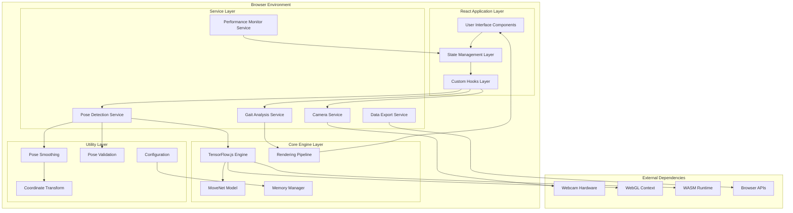
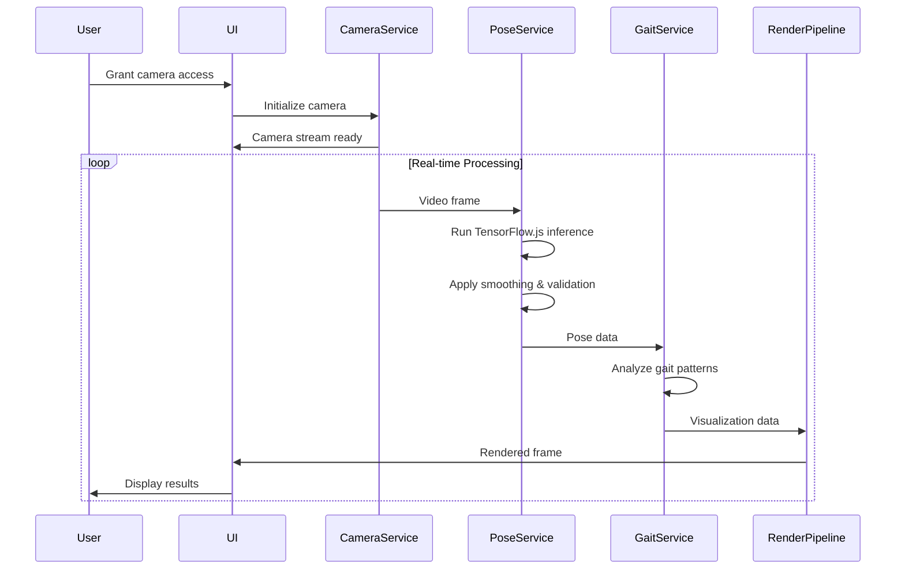

# System Architecture Overview - Phase 2

## 🏗️ High-Level Architecture



## 🎯 Architecture Principles

### 1. Layered Architecture
- **Presentation Layer**: React components and UI logic
- **Service Layer**: Business logic and orchestration
- **Engine Layer**: Core ML and rendering operations
- **Utility Layer**: Cross-cutting concerns and helpers

### 2. Separation of Concerns
- **UI Components**: Pure presentation logic
- **Services**: Stateful business operations
- **Utilities**: Stateless transformation functions
- **Hooks**: State management and side effects

### 3. Performance First
- **Lazy Loading**: Dynamic imports for optimization
- **Memoization**: Aggressive caching strategies
- **WebGL Acceleration**: GPU utilization for rendering
- **WASM Integration**: Native performance for critical paths

### 4. Testability
- **Dependency Injection**: Service layer abstraction
- **Pure Functions**: Functional utility design
- **Mock Interfaces**: Comprehensive testing support
- **Isolated Components**: Unit testing enablement

## 🔄 Data Flow Architecture



## 🧩 Component Architecture

### 1. Core Application Components

```typescript
// Application Root
App
├── ErrorBoundary
├── NotificationProvider
│   ├── CameraView
│   │   ├── VideoDisplay
│   │   ├── PoseOverlay
│   │   └── ControlPanel
│   ├── GaitAnalysisPanel
│   │   ├── MetricsDisplay
│   │   ├── TrajectoryVisualization
│   │   └── ExportControls
│   └── SettingsPanel
       ├── CameraSelector
       ├── PerformanceMonitor
       └── QualityIndicators
```

### 2. Service Layer Architecture

```typescript
// Service Dependencies
ApplicationCoordinator
├── CameraService
├── PoseDetectionService
│   ├── PoseSmoothingService
│   └── PoseValidationService
├── GaitAnalysisService
├── PerformanceMonitorService
├── DataExportService
├── NotificationService
├── LoggingService
└── ConfigurationService
```

### 3. Utility Layer Organization

```typescript
// Utility Modules
Utils
├── CoordinateTransform
├── DistanceCalculation
├── SkeletonRenderer
├── PoseSmoothing
├── PerformanceMonitor
└── ConfigurationManager
```

## 🔧 Technology Stack Details

### Frontend Framework
- **React 18**: Concurrent features and automatic batching
- **TypeScript 5.2+**: Type safety and development experience
- **Vite**: Fast development server and optimized builds
- **CSS Modules**: Scoped styling with responsive design

### Machine Learning Stack
- **TensorFlow.js 4.15+**: Browser-based ML inference
- **MoveNet**: State-of-the-art pose detection model
- **WebGL Backend**: GPU acceleration for performance
- **WASM Support**: Native execution for critical operations

### State Management
- **React Context**: Global application state
- **useReducer**: Complex state transitions
- **Custom Hooks**: Encapsulated business logic
- **Local Storage**: Persistent user preferences

### Performance Optimization
- **React.memo**: Component memoization
- **useMemo/useCallback**: Expensive computation caching
- **Web Workers**: Background processing capability
- **Service Workers**: Offline functionality and caching

## 🚀 Scalability Considerations

### Horizontal Scaling
- **Stateless Design**: No server-side state dependencies
- **CDN Distribution**: Global asset delivery
- **Edge Computing**: Regional model serving
- **Load Balancing**: Traffic distribution strategies

### Vertical Scaling
- **Memory Management**: Efficient resource utilization
- **CPU Optimization**: Multi-threading with Web Workers
- **GPU Utilization**: WebGL compute shader integration
- **Caching Strategies**: Multi-level data caching

### Performance Scaling
- **Adaptive Quality**: Dynamic performance adjustment
- **Model Optimization**: Quantization and pruning
- **Frame Skipping**: Performance degradation handling
- **Resource Monitoring**: Real-time performance tracking

## 🔒 Security Architecture

### Client-Side Security
- **Input Validation**: Camera stream validation
- **XSS Prevention**: Content Security Policy implementation
- **Data Isolation**: No external data transmission
- **Secure Defaults**: Privacy-first configuration

### Privacy Design
- **Local Processing**: No server-side data transmission
- **Consent Management**: Clear permission handling
- **Data Minimization**: Essential data collection only
- **Transparent Operations**: Clear user communication

## 📊 Monitoring & Observability

### Performance Metrics
- **Frame Rate Monitoring**: Real-time FPS tracking
- **Latency Measurement**: End-to-end delay monitoring
- **Memory Usage**: Heap and GPU memory tracking
- **Error Tracking**: Comprehensive error collection

### User Experience Metrics
- **Load Time Measurement**: Application startup performance
- **Feature Usage**: Component interaction tracking
- **Quality Metrics**: Pose detection confidence scoring
- **Accessibility Compliance**: WCAG adherence monitoring

This architecture provides a solid foundation for the pose detection and gait analysis system while maintaining flexibility for future enhancements and scale requirements.