# Test-Driven Development Guide - Phase 3 TDD Implementation

## 🎯 TDD Methodology Overview

### The TDD Cycle

```mermaid
graph LR
    A[🔴 RED: Write Failing Test] --> B[🟢 GREEN: Write Minimal Code]
    B --> C[🔵 REFACTOR: Improve Code]
    C --> D[✅ COMMIT: Save Progress]
    D --> A
    
    style A fill:#ff6b6b
    style B fill:#51cf66
    style C fill:#339af0
    style D fill:#ffd43b
```


### TDD Principles for Pose Detection System
1. **Test First**: Write tests before implementation
2. **Minimal Implementation**: Write just enough code to pass tests
3. **Incremental Development**: Build functionality piece by piece
4. **Continuous Refactoring**: Improve code quality while maintaining tests
5. **Fast Feedback**: Quick test execution for rapid iteration

## 🧪 TDD Implementation Strategy

### 1. Service Layer TDD

#### Pose Detection Service - TDD Example
```typescript
// Step 1: RED - Write failing test
describe('PoseDetectionService', () => {
  describe('initialization', () => {
    it('should initialize with MoveNet model', async () => {
      const service = new PoseDetectionService();
      
      await service.initialize();
      
      expect(service.isInitialized()).toBe(true);
      expect(service.getModelType()).toBe('MoveNet');
    });
  });
});

// Step 2: GREEN - Minimal implementation
export class PoseDetectionService {
  private initialized = false;
  private modelType = 'MoveNet';

  async initialize(): Promise<void> {
    // Minimal implementation
    this.initialized = true;
  }

  isInitialized(): boolean {
    return this.initialized;
  }

  getModelType(): string {
    return this.modelType;
  }
}

// Step 3: REFACTOR - Improve implementation
export class PoseDetectionService {
  private model: PoseNet | null = null;
  private readonly config: PoseDetectionConfig;

  constructor(config: PoseDetectionConfig = DEFAULT_CONFIG) {
    this.config = config;
  }

  async initialize(): Promise<void> {
    try {
      this.model = await tf.loadLayersModel(this.config.modelUrl);
      await this.model.warmup();
    } catch (error) {
      throw new PoseDetectionInitializationError(error);
    }
  }

  isInitialized(): boolean {
    return this.model !== null;
  }

  getModelType(): string {
    return this.config.modelType;
  }
}
```

#### Camera Service - TDD Implementation
```typescript
// RED: Test camera stream access
describe('CameraService', () => {
  describe('stream access', () => {
    it('should request camera stream with specified constraints', async () => {
      const mockGetUserMedia = jest.fn().mockResolvedValue(new MediaStream());
      Object.defineProperty(navigator, 'mediaDevices', {
        value: { getUserMedia: mockGetUserMedia },
        configurable: true
      });

      const service = new CameraService();
      const constraints = { video: { width: 640, height: 480 } };

      const stream = await service.getStream(constraints);

      expect(mockGetUserMedia).toHaveBeenCalledWith(constraints);
      expect(stream).toBeInstanceOf(MediaStream);
    });

    it('should handle camera permission denial', async () => {
      const mockGetUserMedia = jest.fn().mockRejectedValue(
        new DOMException('Permission denied', 'NotAllowedError')
      );
      Object.defineProperty(navigator, 'mediaDevices', {
        value: { getUserMedia: mockGetUserMedia },
        configurable: true
      });

      const service = new CameraService();

      await expect(service.getStream({})).rejects.toThrow('Permission denied');
    });
  });
});

// GREEN: Minimal implementation
export class CameraService {
  async getStream(constraints: MediaStreamConstraints): Promise<MediaStream> {
    return navigator.mediaDevices.getUserMedia(constraints);
  }
}

// REFACTOR: Enhanced implementation
export class CameraService {
  private currentStream: MediaStream | null = null;
  private readonly eventEmitter = new EventEmitter();

  async getStream(constraints: MediaStreamConstraints): Promise<MediaStream> {
    try {
      // Stop existing stream if any
      this.stopStream();

      const stream = await navigator.mediaDevices.getUserMedia(constraints);
      this.currentStream = stream;
      
      this.eventEmitter.emit('streamReady', stream);
      return stream;
    } catch (error) {
      const cameraError = this.createCameraError(error);
      this.eventEmitter.emit('error', cameraError);
      throw cameraError;
    }
  }

  stopStream(): void {
    if (this.currentStream) {
      this.currentStream.getTracks().forEach(track => track.stop());
      this.currentStream = null;
      this.eventEmitter.emit('streamStopped');
    }
  }

  private createCameraError(error: any): CameraError {
    if (error.name === 'NotAllowedError') {
      return new CameraPermissionError('Camera permission denied');
    }
    if (error.name === 'NotFoundError') {
      return new CameraNotFoundError('No camera device found');
    }
    return new CameraError('Camera access failed', error);
  }
}
```

### 2. Component TDD

#### PoseOverlay Component - TDD Approach
```typescript
// RED: Test pose overlay rendering
describe('PoseOverlay Component', () => {
  it('should render skeleton overlay on canvas', () => {
    const mockPoses = [createMockPose()];
    const mockVideoElement = createMockVideoElement();

    render(
      <PoseOverlay
        poses={mockPoses}
        videoElement={mockVideoElement}
        settings={defaultSettings}
      />
    );

    const canvas = screen.getByRole('img'); // Canvas with role="img"
    expect(canvas).toBeInTheDocument();
  });

  it('should update canvas when poses change', () => {
    const { rerender } = render(
      <PoseOverlay
        poses={[]}
        videoElement={createMockVideoElement()}
        settings={defaultSettings}
      />
    );

    const canvas = screen.getByRole('img');
    const mockDraw = jest.spyOn(canvas.getContext('2d'), 'stroke');

    rerender(
      <PoseOverlay
        poses={[createMockPose()]}
        videoElement={createMockVideoElement()}
        settings={defaultSettings}
      />
    );

    expect(mockDraw).toHaveBeenCalled();
  });
});

// GREEN: Basic implementation
export const PoseOverlay: React.FC<PoseOverlayProps> = ({
  poses,
  videoElement,
  settings
}) => {
  const canvasRef = useRef<HTMLCanvasElement>(null);

  useEffect(() => {
    const canvas = canvasRef.current;
    if (!canvas) return;

    const ctx = canvas.getContext('2d');
    if (!ctx) return;

    // Clear canvas
    ctx.clearRect(0, 0, canvas.width, canvas.height);

    // Draw poses
    poses.forEach(pose => {
      drawSkeleton(ctx, pose, settings);
    });
  }, [poses, settings]);

  return (
    <canvas
      ref={canvasRef}
      role="img"
      aria-label="Pose detection overlay"
    />
  );
};

// REFACTOR: Performance optimized implementation
export const PoseOverlay: React.FC<PoseOverlayProps> = ({
  poses,
  videoElement,
  settings
}) => {
  const canvasRef = useRef<HTMLCanvasElement>(null);
  const animationFrameRef = useRef<number>();

  const drawFrame = useCallback(() => {
    const canvas = canvasRef.current;
    if (!canvas || !videoElement) return;

    const ctx = canvas.getContext('2d');
    if (!ctx) return;

    // Sync canvas size with video
    if (canvas.width !== videoElement.videoWidth) {
      canvas.width = videoElement.videoWidth;
      canvas.height = videoElement.videoHeight;
    }

    // Clear and draw
    ctx.clearRect(0, 0, canvas.width, canvas.height);
    
    poses.forEach(pose => {
      if (pose.confidence > settings.confidenceThreshold) {
        drawSkeleton(ctx, pose, settings);
        drawKeypoints(ctx, pose, settings);
      }
    });

    animationFrameRef.current = requestAnimationFrame(drawFrame);
  }, [poses, videoElement, settings]);

  useEffect(() => {
    drawFrame();
    return () => {
      if (animationFrameRef.current) {
        cancelAnimationFrame(animationFrameRef.current);
      }
    };
  }, [drawFrame]);

  return (
    <canvas
      ref={canvasRef}
      role="img"
      aria-label="Pose detection overlay"
      className="pose-overlay"
    />
  );
};
```

### 3. Integration TDD

#### Pose Detection Pipeline - Integration TDD
```typescript
// RED: Test complete pose detection workflow
describe('Pose Detection Pipeline Integration', () => {
  it('should process video frame through complete pipeline', async () => {
    const cameraService = new CameraService();
    const poseService = new PoseDetectionService();
    const smoothingService = new PoseSmoothingService();
    
    // Mock dependencies
    const mockStream = createMockVideoStream();
    jest.spyOn(cameraService, 'getStream').mockResolvedValue(mockStream);
    
    const mockPoses = [createMockPose()];
    jest.spyOn(poseService, 'detectPoses').mockResolvedValue(mockPoses);
    
    const mockSmoothedPoses = [createMockSmoothedPose()];
    jest.spyOn(smoothingService, 'smoothPoses').mockReturnValue(mockSmoothedPoses);

    // Initialize pipeline
    const pipeline = new PoseDetectionPipeline({
      cameraService,
      poseService,
      smoothingService
    });

    await pipeline.initialize();
    const result = await pipeline.processFrame();

    expect(result.poses).toEqual(mockSmoothedPoses);
    expect(result.frameRate).toBeGreaterThan(0);
    expect(result.processingTime).toBeLessThan(100); // 100ms max
  });
});

// GREEN: Basic pipeline implementation
export class PoseDetectionPipeline {
  constructor(private services: PipelineServices) {}

  async initialize(): Promise<void> {
    await this.services.poseService.initialize();
  }

  async processFrame(): Promise<PipelineResult> {
    const startTime = performance.now();
    
    const poses = await this.services.poseService.detectPoses();
    const smoothedPoses = this.services.smoothingService.smoothPoses(poses);
    
    const processingTime = performance.now() - startTime;
    const frameRate = 1000 / processingTime;

    return {
      poses: smoothedPoses,
      frameRate,
      processingTime
    };
  }
}

// REFACTOR: Production-ready implementation
export class PoseDetectionPipeline {
  private readonly performanceMonitor = new PerformanceMonitor();
  private isProcessing = false;

  constructor(
    private readonly services: PipelineServices,
    private readonly config: PipelineConfig = DEFAULT_PIPELINE_CONFIG
  ) {}

  async initialize(): Promise<void> {
    await Promise.all([
      this.services.poseService.initialize(),
      this.services.smoothingService.initialize(),
      this.services.validationService.initialize()
    ]);

    this.performanceMonitor.start();
  }

  async processFrame(videoElement: HTMLVideoElement): Promise<PipelineResult> {
    if (this.isProcessing) {
      return this.getLastResult();
    }

    this.isProcessing = true;
    const startTime = performance.now();

    try {
      // Detect poses
      const rawPoses = await this.services.poseService.detectPoses(videoElement);
      
      // Validate poses
      const validatedPoses = this.services.validationService.validatePoses(rawPoses);
      
      // Apply smoothing
      const smoothedPoses = this.services.smoothingService.smoothPoses(validatedPoses);
      
      // Record performance
      const processingTime = performance.now() - startTime;
      this.performanceMonitor.recordFrame(processingTime);

      const result: PipelineResult = {
        poses: smoothedPoses,
        frameRate: this.performanceMonitor.getCurrentFPS(),
        processingTime,
        confidence: this.calculateOverallConfidence(smoothedPoses),
        timestamp: Date.now()
      };

      this.setLastResult(result);
      return result;
    } finally {
      this.isProcessing = false;
    }
  }

  private calculateOverallConfidence(poses: PoseData[]): number {
    if (poses.length === 0) return 0;
    
    const totalConfidence = poses.reduce((sum, pose) => 
      sum + pose.keypoints.reduce((kpSum, kp) => kpSum + kp.confidence, 0) / pose.keypoints.length, 0
    );
    
    return totalConfidence / poses.length;
  }
}
```

## 🔄 TDD Best Practices

### 1. Test Structure (AAA Pattern)
```typescript
describe('Service Method', () => {
  it('should do something when condition is met', () => {
    // ARRANGE - Set up test data and dependencies
    const service = new ServiceClass();
    const input = createTestInput();
    const expectedOutput = createExpectedOutput();

    // ACT - Execute the method under test
    const result = service.methodUnderTest(input);

    // ASSERT - Verify the results
    expect(result).toEqual(expectedOutput);
  });
});
```

### 2. Test Data Factories
```typescript
// Test data factories for consistent test objects
export const createMockPose = (overrides?: Partial<PoseData>): PoseData => ({
  keypoints: [
    { x: 100, y: 100, confidence: 0.9, name: 'nose' },
    { x: 110, y: 120, confidence: 0.8, name: 'leftEye' },
    { x: 90, y: 120, confidence: 0.8, name: 'rightEye' }
  ],
  confidence: 0.85,
  timestamp: Date.now(),
  ...overrides
});

export const createMockVideoElement = (): HTMLVideoElement => {
  const video = document.createElement('video');
  video.width = 640;
  video.height = 480;
  video.videoWidth = 640;
  video.videoHeight = 480;
  return video;
};

export const createMockMediaStream = (): MediaStream => {
  const stream = new MediaStream();
  const track = new MediaStreamTrack();
  stream.addTrack(track);
  return stream;
};
```

### 3. Mock Management
```typescript
// Centralized mock setup
export const setupMocks = () => {
  // TensorFlow.js mocks
  jest.mock('@tensorflow/tfjs', () => ({
    loadLayersModel: jest.fn().mockResolvedValue(createMockModel()),
    browser: {
      fromPixels: jest.fn().mockReturnValue(createMockTensor()),
    }
  }));

  // Browser API mocks
  Object.defineProperty(global.navigator, 'mediaDevices', {
    value: {
      getUserMedia: jest.fn().mockResolvedValue(createMockMediaStream()),
      enumerateDevices: jest.fn().mockResolvedValue([createMockCamera()])
    },
    configurable: true
  });

  // Canvas API mocks
  HTMLCanvasElement.prototype.getContext = jest.fn().mockReturnValue({
    clearRect: jest.fn(),
    drawImage: jest.fn(),
    stroke: jest.fn(),
    fill: jest.fn()
  });
};
```

### 4. Performance Testing in TDD
```typescript
describe('Performance Requirements', () => {
  it('should process poses within performance budget', async () => {
    const service = new PoseDetectionService();
    await service.initialize();

    const startTime = performance.now();
    const result = await service.detectPoses(createMockVideoFrame());
    const processingTime = performance.now() - startTime;

    expect(processingTime).toBeLessThan(33); // ~30 FPS requirement
    expect(result.poses).toBeDefined();
  });

  it('should maintain memory usage within limits', () => {
    const initialMemory = performance.memory?.usedJSHeapSize || 0;
    
    const service = new PoseDetectionService();
    // Simulate heavy usage
    for (let i = 0; i < 1000; i++) {
      service.detectPoses(createMockVideoFrame());
    }

    const finalMemory = performance.memory?.usedJSHeapSize || 0;
    const memoryIncrease = finalMemory - initialMemory;
    
    expect(memoryIncrease).toBeLessThan(50 * 1024 * 1024); // 50MB limit
  });
});
```

## 📊 TDD Metrics & Quality Gates

### Test Quality Metrics
```typescript
// Test coverage requirements
export const COVERAGE_REQUIREMENTS = {
  statements: 90,
  branches: 85,
  functions: 95,
  lines: 90
};

// Performance test thresholds
export const PERFORMANCE_THRESHOLDS = {
  poseDetection: 33, // ms (30 FPS)
  frameProcessing: 16, // ms (60 FPS)
  memoryUsage: 512, // MB
  bundleSize: 2048 // KB
};

// Quality gates for CI/CD
export const QUALITY_GATES = {
  testPassRate: 100, // %
  coverageThreshold: 90, // %
  performanceRegression: 5, // %
  codeComplexity: 10 // max cyclomatic complexity
};
```

This TDD guide ensures systematic, test-first development with comprehensive coverage, performance validation, and maintainable test suites for the pose detection system.