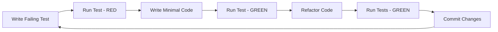

# Development Workflow - Phase 4 Implementation

## 🚀 Development Methodology

### Agile Development Process
- **Sprint Duration**: 2-week iterations
- **Planning Meetings**: Sprint planning and retrospectives  
- **Daily Standups**: Progress tracking and blocker identification
- **Code Reviews**: Mandatory peer review process
- **Continuous Integration**: Automated testing and deployment

### TDD Implementation Workflow


## 🔄 Git Workflow Strategy

### Branch Strategy
```
main (production)
├── develop (integration)
│   ├── feature/pose-detection-engine
│   ├── feature/gait-analysis-module  
│   ├── feature/performance-optimization
│   └── feature/ui-components
├── hotfix/critical-bug-fix
└── release/v1.0.0
```

### Commit Convention
```bash
# Conventional Commits Format
<type>(<scope>): <description>

[optional body]

[optional footer]

# Examples
feat(pose): add MoveNet model integration
fix(camera): resolve permission handling bug
docs(api): update pose detection documentation
test(gait): add comprehensive gait analysis tests
perf(render): optimize skeleton rendering pipeline
```

### Code Review Process
1. **Feature Branch Creation**: From develop branch
2. **Implementation**: TDD approach with regular commits
3. **Self Review**: Code quality and test coverage check
4. **Pull Request**: Comprehensive description and testing evidence
5. **Peer Review**: Minimum 2 approvals required
6. **Automated Checks**: CI/CD pipeline validation
7. **Merge**: Squash and merge to develop

## 🛠️ Development Environment Setup

### Prerequisites Installation
```bash
# Node.js and Package Manager
nvm install 18.17.0
nvm use 18.17.0
npm install -g npm@latest

# Development Tools
npm install -g typescript@latest
npm install -g @typescript-eslint/eslint-plugin
npm install -g cypress
```

### Project Setup
```bash
# Clone and Setup
git clone <repository-url>
cd pose-detection-system
npm install

# Environment Configuration
cp .env.example .env.local
# Configure camera permissions and API endpoints

# Development Server
npm run dev              # Start development server
npm run test:watch       # Start test watcher
npm run lint:watch       # Start linter watcher
```

### IDE Configuration
```json
// VSCode Settings (.vscode/settings.json)
{
  "typescript.preferences.includePackageJsonAutoImports": "on",
  "editor.codeActionsOnSave": {
    "source.fixAll.eslint": true,
    "source.organizeImports": true
  },
  "editor.formatOnSave": true,
  "editor.defaultFormatter": "esbenp.prettier-vscode",
  "vitest.enable": true,
  "vitest.commandLine": "npm run test"
}
```

## 📝 Coding Standards & Guidelines

### TypeScript Configuration
```typescript
// Strict Type Safety
interface StrictConfig {
  strict: true;
  noImplicitAny: true;
  noImplicitReturns: true;
  noUnusedLocals: true;
  noUnusedParameters: true;
  exactOptionalPropertyTypes: true;
}

// Code Organization
export interface CodeStructure {
  components: ComponentInterface;
  services: ServiceInterface;
  utils: UtilityInterface;
  types: TypeDefinitions;
  tests: TestSpecifications;
}
```

### Component Development Standards
```typescript
// React Component Template
interface ComponentProps {
  // All props must be explicitly typed
  id: string;
  className?: string;
  children?: React.ReactNode;
}

export const ComponentName: React.FC<ComponentProps> = ({
  id,
  className,
  children
}) => {
  // 1. Hooks at the top
  const [state, setState] = useState<StateType>();
  const { data, loading, error } = useCustomHook();
  
  // 2. Event handlers
  const handleEvent = useCallback((event: EventType) => {
    // Implementation
  }, [dependencies]);
  
  // 3. Early returns for loading/error states
  if (loading) return <LoadingSpinner />;
  if (error) return <ErrorDisplay error={error} />;
  
  // 4. Main render logic
  return (
    <div id={id} className={className}>
      {children}
    </div>
  );
};

// Default props and display name
ComponentName.displayName = 'ComponentName';
```

### Service Development Standards
```typescript
// Service Interface Definition
export interface ServiceInterface {
  initialize(): Promise<void>;
  cleanup(): Promise<void>;
  isReady(): boolean;
}

// Service Implementation Template
export class ServiceImplementation implements ServiceInterface {
  private initialized = false;
  private readonly config: ServiceConfig;
  
  constructor(config: ServiceConfig) {
    this.config = config;
  }
  
  async initialize(): Promise<void> {
    if (this.initialized) return;
    
    try {
      // Initialization logic
      this.initialized = true;
    } catch (error) {
      throw new ServiceInitializationError(error);
    }
  }
  
  async cleanup(): Promise<void> {
    // Cleanup logic
    this.initialized = false;
  }
  
  isReady(): boolean {
    return this.initialized;
  }
}
```

## 🧪 Test-First Development Process

### TDD Cycle Implementation
```typescript
// 1. RED - Write Failing Test
describe('PoseDetectionService', () => {
  it('should detect poses from video frame', async () => {
    const service = new PoseDetectionService();
    const mockFrame = createMockVideoFrame();
    
    const result = await service.detectPoses(mockFrame);
    
    expect(result).toBeDefined();
    expect(result.poses).toHaveLength(1);
    expect(result.confidence).toBeGreaterThan(0.8);
  });
});

// 2. GREEN - Minimal Implementation
export class PoseDetectionService {
  async detectPoses(frame: VideoFrame): Promise<PoseResult> {
    // Minimal implementation to pass test
    return {
      poses: [{ keypoints: [] }],
      confidence: 0.9
    };
  }
}

// 3. REFACTOR - Improve Implementation
export class PoseDetectionService {
  private model: PoseNet;
  
  async detectPoses(frame: VideoFrame): Promise<PoseResult> {
    if (!this.model) {
      throw new Error('Model not initialized');
    }
    
    const poses = await this.model.estimatePoses(frame);
    return this.formatResult(poses);
  }
  
  private formatResult(poses: Pose[]): PoseResult {
    // Proper implementation
  }
}
```

### Testing Workflow
```bash
# TDD Development Cycle
npm run test:watch          # Continuous test execution
npm run test:coverage       # Coverage reporting
npm run test:debug          # Debug mode testing
npm run test:ui             # Visual test interface

# Integration Testing
npm run test:integration    # Service integration tests
npm run test:e2e           # End-to-end workflows
npm run test:performance   # Performance benchmarks
```

## 📊 Code Quality Assurance

### Automated Quality Checks
```yaml
# Pre-commit Hooks (.husky/pre-commit)
#!/bin/sh
npm run lint
npm run typecheck  
npm run test:unit
npm run format:check
```

### Quality Metrics
- **Code Coverage**: >90% for all modules
- **TypeScript Compliance**: 100% strict mode
- **ESLint Rules**: Zero warnings policy
- **Performance Budget**: <50ms for critical operations
- **Bundle Size**: <2MB total application size

### Code Review Checklist
```markdown
## Code Review Checklist

### Functionality
- [ ] Feature works as designed
- [ ] Edge cases are handled
- [ ] Error handling is comprehensive
- [ ] Performance requirements are met

### Code Quality
- [ ] Follows TypeScript best practices
- [ ] Proper error handling
- [ ] Comprehensive test coverage
- [ ] Documentation is complete

### Architecture
- [ ] Follows established patterns
- [ ] Proper separation of concerns
- [ ] Reusable and maintainable
- [ ] Consistent with existing codebase

### Testing
- [ ] Unit tests cover functionality
- [ ] Integration tests validate workflows
- [ ] Performance tests verify requirements
- [ ] Tests are reliable and fast
```

## 🚀 Continuous Integration Workflow

### CI/CD Pipeline Stages
```yaml
# GitHub Actions Workflow
name: CI/CD Pipeline

on: [push, pull_request]

jobs:
  quality_checks:
    runs-on: ubuntu-latest
    steps:
      - name: Checkout code
      - name: Setup Node.js
      - name: Install dependencies
      - name: Run linting
      - name: Type checking
      - name: Unit tests
      - name: Coverage report
      
  integration_tests:
    runs-on: ubuntu-latest
    needs: quality_checks
    steps:
      - name: Integration tests
      - name: E2E tests
      - name: Performance tests
      
  build_and_deploy:
    runs-on: ubuntu-latest
    needs: [quality_checks, integration_tests]
    steps:
      - name: Build application
      - name: Docker image build
      - name: Deploy to staging
      - name: Smoke tests
```

### Deployment Strategy
- **Development**: Automatic deployment to dev environment
- **Staging**: Manual deployment after integration tests
- **Production**: Manual approval with rollback capability
- **Hotfixes**: Fast-track deployment for critical fixes

## 📈 Performance Monitoring

### Development Performance Tracking
```typescript
// Performance Monitoring Integration
export const performanceMonitor = {
  measureFrameRate: () => {
    // FPS measurement implementation
  },
  
  measureMemoryUsage: () => {
    // Memory tracking implementation
  },
  
  measureLoadTime: () => {
    // Load time measurement
  }
};

// Performance Budgets
export const PERFORMANCE_BUDGETS = {
  FRAME_RATE: 60,           // FPS minimum
  MEMORY_LIMIT: 512,        // MB maximum
  LOAD_TIME: 3000,          // ms maximum
  INTERACTION_DELAY: 100    // ms maximum
};
```

### Code Quality Metrics
- **Cyclomatic Complexity**: <10 per function
- **Code Duplication**: <3% total codebase
- **Technical Debt**: <1 hour per 100 LOC
- **Bug Density**: <0.1 bugs per KLOC

This development workflow ensures consistent, high-quality code delivery while maintaining optimal performance and comprehensive test coverage.