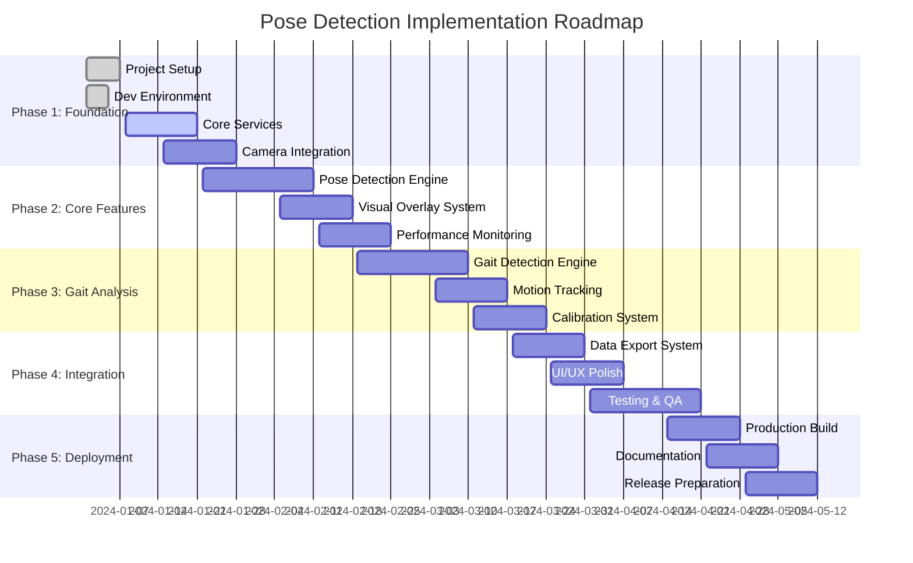

# Implementation Roadmap - Phase 4 Implementation

## 🗺️ Comprehensive Implementation Strategy

### Project Timeline Overview


## 📋 Detailed Implementation Backlog

### Sprint 1: Project Foundation (Week 1-2)

#### 🏗️ EPIC-001: Development Environment Setup
**Story Points**: 13  
**Priority**: Critical  
**Dependencies**: None

**Tasks Breakdown**:
```yaml
Infrastructure Setup:
  - DEV-001: Initialize Vite + React + TypeScript project
    Effort: 2 hours
    Acceptance: Project builds successfully with hot reload
    
  - DEV-002: Configure ESLint + Prettier + Husky hooks
    Effort: 3 hours
    Acceptance: Code quality gates enforced automatically
    
  - DEV-003: Setup Vitest + React Testing Library
    Effort: 4 hours
    Acceptance: Test suite runs with coverage reporting
    
  - DEV-004: Configure Docker development environment
    Effort: 6 hours
    Acceptance: Containerized development with live reload
    
  - DEV-005: Setup CI/CD pipeline (GitHub Actions)
    Effort: 8 hours
    Acceptance: Automated testing and deployment on PR/merge
```

**Implementation Pseudocode**:
```typescript
// Project initialization script
const initializeProject = async () => {
  // 1. Create Vite project with TypeScript template
  await executeCommand('npm create vite@latest pose-detection -- --template react-ts');
  
  // 2. Install dependencies
  const dependencies = [
    '@tensorflow/tfjs@^4.15.0',
    '@tensorflow-models/pose-detection@^2.1.3',
    'framer-motion@^10.16.0',
    'lucide-react@^0.294.0'
  ];
  
  const devDependencies = [
    'vitest@^1.1.0',
    '@testing-library/react@^14.1.2',
    '@vitest/coverage-v8@^1.1.0',
    'eslint@^8.55.0',
    'prettier@^3.1.0',
    'husky@^8.0.3'
  ];
  
  await installDependencies(dependencies, devDependencies);
  
  // 3. Configure build tools and quality gates
  await setupBuildConfiguration();
  await setupQualityGates();
  await setupTestingFramework();
};
```

#### 🏛️ EPIC-002: Core Architecture Implementation
**Story Points**: 21  
**Priority**: Critical  
**Dependencies**: DEV-001 through DEV-005

**Tasks Breakdown**:
```yaml
Architecture Foundation:
  - ARCH-001: Implement service layer base classes
    Effort: 4 hours
    Acceptance: BaseService with lifecycle management
    
  - ARCH-002: Create dependency injection container
    Effort: 6 hours
    Acceptance: ServiceContainer manages all service instances
    
  - ARCH-003: Setup React context providers
    Effort: 4 hours
    Acceptance: Application context with typed state management
    
  - ARCH-004: Implement error boundary system
    Effort: 3 hours
    Acceptance: Global error handling with recovery options
    
  - ARCH-005: Create performance monitoring foundation
    Effort: 6 hours
    Acceptance: Real-time metrics collection and reporting
```

**Architecture Implementation**:
```typescript
// Service layer base implementation
abstract class BaseService {
  protected _isInitialized = false;
  protected _name: string;
  
  constructor(name: string) {
    this._name = name;
  }
  
  abstract initialize(): Promise<void>;
  abstract cleanup(): Promise<void>;
  
  get isInitialized(): boolean {
    return this._isInitialized;
  }
  
  protected setInitialized(value: boolean): void {
    this._isInitialized = value;
    this.notifyStateChange();
  }
  
  private notifyStateChange(): void {
    // Emit service state change events
    ServiceEventBus.emit('service:state-change', {
      service: this._name,
      initialized: this._isInitialized
    });
  }
}

// Dependency injection implementation
class ServiceContainer {
  private services = new Map<string, any>();
  private factories = new Map<string, () => any>();
  
  register<T>(token: string, factory: () => T): void {
    this.factories.set(token, factory);
  }
  
  get<T>(token: string): T {
    if (!this.services.has(token)) {
      const factory = this.factories.get(token);
      if (!factory) {
        throw new Error(`Service not registered: ${token}`);
      }
      this.services.set(token, factory());
    }
    return this.services.get(token);
  }
  
  async initializeAll(): Promise<void> {
    const initPromises = Array.from(this.services.values())
      .filter(service => service.initialize)
      .map(service => service.initialize());
    
    await Promise.all(initPromises);
  }
}
```

### Sprint 2: Camera Integration (Week 3-4)

#### 📷 EPIC-003: Camera Service Implementation
**Story Points**: 18  
**Priority**: Critical  
**Dependencies**: ARCH-001, ARCH-002

**Tasks Breakdown**:
```yaml
Camera Management:
  - CAM-001: Implement basic camera access
    Effort: 4 hours
    Acceptance: getUserMedia integration with error handling
    
  - CAM-002: Add camera device enumeration
    Effort: 3 hours
    Acceptance: List and select available cameras
    
  - CAM-003: Implement stream management
    Effort: 5 hours
    Acceptance: Start/stop/switch camera streams reliably
    
  - CAM-004: Add resolution and constraints handling
    Effort: 4 hours
    Acceptance: Configure video quality and format
    
  - CAM-005: Create camera permission management
    Effort: 3 hours
    Acceptance: Handle permission states and recovery
```

**Camera Service Implementation**:
```typescript
// Camera service with comprehensive error handling
class CameraService extends BaseService {
  private currentStream: MediaStream | null = null;
  private deviceList: MediaDeviceInfo[] = [];
  private permissionState: PermissionState = 'prompt';
  
  async initialize(): Promise<void> {
    try {
      await this.checkPermissionState();
      await this.enumerateDevices();
      this.setInitialized(true);
    } catch (error) {
      throw new CameraInitializationError('Failed to initialize camera service', error);
    }
  }
  
  async getStream(constraints: MediaStreamConstraints): Promise<MediaStream> {
    try {
      // Stop existing stream
      this.stopCurrentStream();
      
      // Request new stream with fallback constraints
      this.currentStream = await this.requestStreamWithFallback(constraints);
      
      // Setup stream event listeners
      this.setupStreamEventListeners(this.currentStream);
      
      return this.currentStream;
    } catch (error) {
      throw this.createCameraError(error);
    }
  }
  
  private async requestStreamWithFallback(
    constraints: MediaStreamConstraints
  ): Promise<MediaStream> {
    const fallbackConstraints = [
      constraints,
      { video: { width: 640, height: 480 } },
      { video: true },
    ];
    
    for (const constraint of fallbackConstraints) {
      try {
        return await navigator.mediaDevices.getUserMedia(constraint);
      } catch (error) {
        console.warn('Camera constraint failed, trying fallback:', error);
      }
    }
    
    throw new Error('Unable to access camera with any constraints');
  }
  
  private setupStreamEventListeners(stream: MediaStream): void {
    stream.getTracks().forEach(track => {
      track.addEventListener('ended', () => {
        this.handleStreamEnded();
      });
      
      track.addEventListener('mute', () => {
        this.handleStreamMuted();
      });
    });
  }
  
  private createCameraError(error: any): CameraError {
    switch (error.name) {
      case 'NotAllowedError':
        return new CameraPermissionError('Camera access denied');
      case 'NotFoundError':
        return new CameraNotFoundError('No camera devices available');
      case 'NotReadableError':
        return new CameraHardwareError('Camera hardware error');
      default:
        return new CameraError('Camera access failed', error);
    }
  }
}
```

### Sprint 3: Pose Detection Engine (Week 5-6)

#### 🤖 EPIC-004: TensorFlow.js Integration
**Story Points**: 25  
**Priority**: Critical  
**Dependencies**: CAM-001 through CAM-005

**Tasks Breakdown**:
```yaml
ML Model Integration:
  - ML-001: TensorFlow.js initialization and backend setup
    Effort: 6 hours
    Acceptance: TF.js loads with optimal backend (WebGL/CPU)
    
  - ML-002: MoveNet model loading and configuration
    Effort: 8 hours
    Acceptance: Lightning and Thunder models load successfully
    
  - ML-003: Pose detection pipeline implementation
    Effort: 10 hours
    Acceptance: Real-time pose detection at 30+ FPS
    
  - ML-004: Performance optimization and adaptive quality
    Effort: 8 hours
    Acceptance: Dynamic quality adjustment based on performance
    
  - ML-005: Memory management and cleanup
    Effort: 4 hours
    Acceptance: No memory leaks during extended use
```

**Pose Detection Implementation**:
```typescript
// Optimized pose detection pipeline (2024 best practices)
class PoseDetectionService extends BaseService {
  private detector: poseDetection.PoseDetector | null = null;
  private model: 'lightning' | 'thunder' = 'lightning';
  private adaptiveQuality = new AdaptiveQualityManager();
  
  async initialize(): Promise<void> {
    try {
      // Initialize TensorFlow.js with optimal backend
      await tf.ready();
      await this.setupOptimalBackend();
      
      // Load MoveNet model with 2024 optimizations
      this.detector = await poseDetection.createDetector(
        poseDetection.SupportedModels.MoveNet,
        {
          modelType: this.getModelType(),
          enableSmoothing: false, // Handle smoothing separately
          minPoseScore: 0.3,
          multiPoseMaxDimension: 256
        }
      );
      
      // Warm up model for consistent performance
      await this.warmupModel();
      
      this.setInitialized(true);
    } catch (error) {
      throw new PoseDetectionError('Failed to initialize pose detection', error);
    }
  }
  
  async detectPoses(input: VideoFrame): Promise<PoseResult[]> {
    if (!this.detector) {
      throw new Error('Pose detector not initialized');
    }
    
    const startTime = performance.now();
    
    try {
      // Apply adaptive quality management
      const processedInput = await this.adaptiveQuality.preprocessInput(input);
      
      // Run pose estimation with optimized parameters
      const poses = await this.detector.estimatePoses(processedInput, {
        maxPoses: 1,
        flipHorizontal: false,
        scoreThreshold: 0.3
      });
      
      // Post-process results with validation and smoothing
      const results = await this.postProcessPoses(poses);
      
      // Update adaptive quality based on performance
      const processingTime = performance.now() - startTime;
      this.adaptiveQuality.updatePerformanceMetrics(processingTime);
      
      return results;
    } catch (error) {
      console.error('Pose detection failed:', error);
      return [];
    }
  }
  
  private async setupOptimalBackend(): Promise<void> {
    // 2024 optimization: Prefer WebGL with fallback to WASM then CPU
    const backends = ['webgl', 'wasm', 'cpu'];
    
    for (const backend of backends) {
      try {
        await tf.setBackend(backend);
        if (backend === 'webgl') {
          // Enable WebGL optimizations for MoveNet
          tf.ENV.set('WEBGL_PACK', true);
          tf.ENV.set('WEBGL_FORCE_F16_TEXTURES', true);
          tf.ENV.set('WEBGL_RENDER_FLOAT32_CAPABLE', true);
        }
        break;
      } catch (error) {
        console.warn(`Failed to set ${backend} backend:`, error);
      }
    }
  }
  
  private async warmupModel(): Promise<void> {
    // Warm up model with dummy input for consistent performance
    const dummyInput = tf.zeros([1, 192, 192, 3]);
    await this.detector!.estimatePoses(dummyInput);
    dummyInput.dispose();
  }
}

// Adaptive quality management for 2024 performance standards
class AdaptiveQualityManager {
  private performanceHistory: number[] = [];
  private currentQuality: 'high' | 'medium' | 'low' = 'high';
  private targetFrameTime = 33; // 30 FPS target
  
  async preprocessInput(input: VideoFrame): Promise<VideoFrame> {
    switch (this.currentQuality) {
      case 'high':
        return this.resizeInput(input, 256, 256);
      case 'medium':
        return this.resizeInput(input, 192, 192);
      case 'low':
        return this.resizeInput(input, 128, 128);
    }
  }
  
  updatePerformanceMetrics(processingTime: number): void {
    this.performanceHistory.push(processingTime);
    
    // Keep only recent measurements
    if (this.performanceHistory.length > 30) {
      this.performanceHistory.shift();
    }
    
    // Adjust quality based on recent performance
    const avgTime = this.performanceHistory.reduce((a, b) => a + b) / this.performanceHistory.length;
    
    if (avgTime > this.targetFrameTime * 1.5) {
      // Performance is poor, reduce quality
      if (this.currentQuality === 'high') {
        this.currentQuality = 'medium';
      } else if (this.currentQuality === 'medium') {
        this.currentQuality = 'low';
      }
    } else if (avgTime < this.targetFrameTime * 0.7) {
      // Performance is good, increase quality
      if (this.currentQuality === 'low') {
        this.currentQuality = 'medium';
      } else if (this.currentQuality === 'medium') {
        this.currentQuality = 'high';
      }
    }
  }
  
  private async resizeInput(input: VideoFrame, width: number, height: number): Promise<VideoFrame> {
    // Efficient input resizing for performance optimization
    const canvas = document.createElement('canvas');
    canvas.width = width;
    canvas.height = height;
    
    const ctx = canvas.getContext('2d')!;
    ctx.drawImage(input, 0, 0, width, height);
    
    return canvas;
  }
}
```

### Sprint 4: Visual Overlay System (Week 7-8)

#### 🎨 EPIC-005: Real-Time Visualization
**Story Points**: 20  
**Priority**: High  
**Dependencies**: ML-001 through ML-005

**Tasks Breakdown**:
```yaml
Visualization System:
  - VIS-001: Canvas-based pose overlay renderer
    Effort: 6 hours
    Acceptance: Skeleton lines and keypoints render at 60 FPS
    
  - VIS-002: Confidence-based visual feedback
    Effort: 4 hours
    Acceptance: Color coding based on detection confidence
    
  - VIS-003: Motion trail visualization
    Effort: 5 hours
    Acceptance: Historical pose data shows movement patterns
    
  - VIS-004: Customizable visual settings
    Effort: 3 hours
    Acceptance: User can adjust colors, thickness, visibility
    
  - VIS-005: Performance-optimized rendering
    Effort: 4 hours
    Acceptance: Rendering doesn't impact detection performance
```

**Visual Overlay Implementation**:
```typescript
// High-performance pose overlay renderer
class PoseOverlayRenderer {
  private canvas: HTMLCanvasElement;
  private ctx: CanvasRenderingContext2D;
  private animationFrame: number | null = null;
  private poseHistory: PoseData[] = [];
  
  constructor(canvas: HTMLCanvasElement) {
    this.canvas = canvas;
    this.ctx = canvas.getContext('2d')!;
    this.setupCanvasOptimizations();
  }
  
  render(poses: PoseData[], settings: VisualizationSettings): void {
    // Cancel previous animation frame
    if (this.animationFrame) {
      cancelAnimationFrame(this.animationFrame);
    }
    
    this.animationFrame = requestAnimationFrame(() => {
      this.renderFrame(poses, settings);
    });
  }
  
  private renderFrame(poses: PoseData[], settings: VisualizationSettings): void {
    // Clear canvas efficiently
    this.ctx.clearRect(0, 0, this.canvas.width, this.canvas.height);
    
    // Update pose history for motion trails
    this.updatePoseHistory(poses);
    
    // Render motion trails if enabled
    if (settings.showMotionTrails) {
      this.renderMotionTrails(settings);
    }
    
    // Render current poses
    poses.forEach(pose => {
      this.renderPose(pose, settings);
    });
    
    // Render confidence indicators
    if (settings.showConfidenceIndicators) {
      this.renderConfidenceIndicators(poses, settings);
    }
  }
  
  private renderPose(pose: PoseData, settings: VisualizationSettings): void {
    // Render skeleton connections
    if (settings.showSkeleton) {
      this.renderSkeleton(pose, settings);
    }
    
    // Render keypoints
    if (settings.showKeypoints) {
      this.renderKeypoints(pose, settings);
    }
  }
  
  private renderSkeleton(pose: PoseData, settings: VisualizationSettings): void {
    const connections = [
      ['nose', 'left_eye'], ['nose', 'right_eye'],
      ['left_eye', 'left_ear'], ['right_eye', 'right_ear'],
      ['left_shoulder', 'right_shoulder'],
      ['left_shoulder', 'left_elbow'], ['left_elbow', 'left_wrist'],
      ['right_shoulder', 'right_elbow'], ['right_elbow', 'right_wrist'],
      ['left_shoulder', 'left_hip'], ['right_shoulder', 'right_hip'],
      ['left_hip', 'right_hip'],
      ['left_hip', 'left_knee'], ['left_knee', 'left_ankle'],
      ['right_hip', 'right_knee'], ['right_knee', 'right_ankle']
    ];
    
    this.ctx.strokeStyle = settings.skeletonColor;
    this.ctx.lineWidth = settings.skeletonWidth;
    this.ctx.lineCap = 'round';
    
    connections.forEach(([fromName, toName]) => {
      const from = pose.keypoints.find(kp => kp.name === fromName);
      const to = pose.keypoints.find(kp => kp.name === toName);
      
      if (from && to && from.confidence > settings.confidenceThreshold && to.confidence > settings.confidenceThreshold) {
        this.ctx.beginPath();
        this.ctx.moveTo(from.x, from.y);
        this.ctx.lineTo(to.x, to.y);
        this.ctx.stroke();
      }
    });
  }
  
  private renderKeypoints(pose: PoseData, settings: VisualizationSettings): void {
    pose.keypoints.forEach(keypoint => {
      if (keypoint.confidence > settings.confidenceThreshold) {
        const color = this.getConfidenceColor(keypoint.confidence, settings);
        const radius = settings.keypointRadius * (0.5 + keypoint.confidence * 0.5);
        
        this.ctx.fillStyle = color;
        this.ctx.beginPath();
        this.ctx.arc(keypoint.x, keypoint.y, radius, 0, 2 * Math.PI);
        this.ctx.fill();
      }
    });
  }
  
  private renderMotionTrails(settings: VisualizationSettings): void {
    const trailLength = Math.min(this.poseHistory.length, settings.motionTrailLength);
    
    for (let i = 0; i < trailLength - 1; i++) {
      const alpha = (i + 1) / trailLength;
      const currentPose = this.poseHistory[this.poseHistory.length - 1 - i];
      const nextPose = this.poseHistory[this.poseHistory.length - 2 - i];
      
      this.ctx.strokeStyle = `rgba(${settings.motionTrailColor}, ${alpha})`;
      this.ctx.lineWidth = settings.motionTrailWidth * alpha;
      
      // Draw trail for key points (ankles for gait analysis)
      ['left_ankle', 'right_ankle'].forEach(keypointName => {
        const current = currentPose.keypoints.find(kp => kp.name === keypointName);
        const next = nextPose.keypoints.find(kp => kp.name === keypointName);
        
        if (current && next && current.confidence > 0.5 && next.confidence > 0.5) {
          this.ctx.beginPath();
          this.ctx.moveTo(current.x, current.y);
          this.ctx.lineTo(next.x, next.y);
          this.ctx.stroke();
        }
      });
    }
  }
  
  private setupCanvasOptimizations(): void {
    // Enable hardware acceleration
    this.ctx.imageSmoothingEnabled = false;
    
    // Setup high-DPI support
    const dpr = window.devicePixelRatio || 1;
    const rect = this.canvas.getBoundingClientRect();
    
    this.canvas.width = rect.width * dpr;
    this.canvas.height = rect.height * dpr;
    this.ctx.scale(dpr, dpr);
    
    this.canvas.style.width = rect.width + 'px';
    this.canvas.style.height = rect.height + 'px';
  }
}
```

## 📊 Implementation Progress Tracking

### Progress Monitoring Dashboard
```typescript
interface ImplementationMetrics {
  sprintProgress: {
    sprintNumber: number;
    completedStoryPoints: number;
    totalStoryPoints: number;
    velocity: number;
    burndownRate: number;
  };
  
  qualityMetrics: {
    testCoverage: number;
    codeQuality: number;
    performanceBenchmarks: PerformanceBenchmark[];
    technicalDebt: number;
  };
  
  riskAssessment: {
    blockers: Blocker[];
    dependencies: Dependency[];
    resourceConstraints: ResourceConstraint[];
  };
}

const trackImplementationProgress = (): ImplementationMetrics => {
  return {
    sprintProgress: calculateSprintMetrics(),
    qualityMetrics: assessCodeQuality(),
    riskAssessment: evaluateProjectRisks()
  };
};
```

This comprehensive implementation roadmap provides detailed task breakdown, code examples, and progress tracking for successful pose detection system development with 2024 best practices integration.