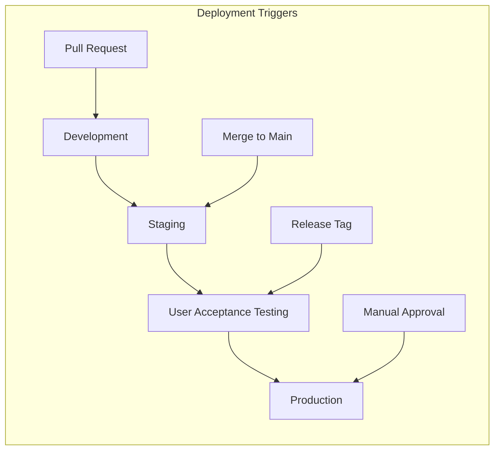

# Deployment Strategy - Phase 5 Integration & Production

## 🎯 Deployment Overview

### Multi-Environment Strategy


### Environment Configuration
| Environment | Purpose | URL Pattern | Deployment Trigger |
|-------------|---------|-------------|-------------------|
| Development | Feature development | `dev-*.example.com` | Every PR |
| Staging | Integration testing | `staging.example.com` | Main branch merge |
| UAT | User acceptance | `uat.example.com` | Release candidate |
| Production | Live application | `app.example.com` | Manual approval |

## 🏗️ Infrastructure Architecture

### Container-Based Deployment
```dockerfile
# Multi-stage Docker Build Strategy
FROM node:18-alpine AS builder
WORKDIR /app
COPY package*.json ./
RUN npm ci --only=production

COPY . .
RUN npm run build

FROM nginx:alpine AS production
COPY --from=builder /app/dist /usr/share/nginx/html
COPY nginx.conf /etc/nginx/nginx.conf
EXPOSE 80
CMD ["nginx", "-g", "daemon off;"]
```

### Kubernetes Deployment Configuration
```yaml
# Kubernetes Deployment Manifest
apiVersion: apps/v1
kind: Deployment
metadata:
  name: pose-detection-app
  labels:
    app: pose-detection
    version: v1.0.0
spec:
  replicas: 3
  selector:
    matchLabels:
      app: pose-detection
  template:
    metadata:
      labels:
        app: pose-detection
        version: v1.0.0
    spec:
      containers:
      - name: pose-detection
        image: pose-detection:latest
        ports:
        - containerPort: 80
        env:
        - name: BASE_PATH
          value: "/pose"
        resources:
          requests:
            memory: "256Mi"
            cpu: "250m"
          limits:
            memory: "512Mi"
            cpu: "500m"
        livenessProbe:
          httpGet:
            path: /health
            port: 80
          initialDelaySeconds: 30
          periodSeconds: 10
        readinessProbe:
          httpGet:
            path: /ready
            port: 80
          initialDelaySeconds: 5
          periodSeconds: 5
```

## 🚀 CI/CD Pipeline Implementation

### GitHub Actions Workflow
```yaml
# .github/workflows/deploy.yml
name: Deploy Pose Detection Application

on:
  push:
    branches: [main, develop]
    tags: ['v*']
  pull_request:
    branches: [main]

env:
  REGISTRY: ghcr.io
  IMAGE_NAME: ${{ github.repository }}

jobs:
  test:
    runs-on: ubuntu-latest
    steps:
      - uses: actions/checkout@v4
      
      - name: Setup Node.js
        uses: actions/setup-node@v4
        with:
          node-version: '18'
          cache: 'npm'
          
      - name: Install dependencies
        run: npm ci
        
      - name: Run tests
        run: |
          npm run lint
          npm run typecheck
          npm run test:coverage
          npm run test:e2e
          
      - name: Upload coverage
        uses: codecov/codecov-action@v3

  build:
    needs: test
    runs-on: ubuntu-latest
    outputs:
      image: ${{ steps.image.outputs.image }}
      digest: ${{ steps.build.outputs.digest }}
    steps:
      - uses: actions/checkout@v4
      
      - name: Setup Docker Buildx
        uses: docker/setup-buildx-action@v3
        
      - name: Login to Container Registry
        uses: docker/login-action@v3
        with:
          registry: ${{ env.REGISTRY }}
          username: ${{ github.actor }}
          password: ${{ secrets.GITHUB_TOKEN }}
          
      - name: Extract metadata
        id: meta
        uses: docker/metadata-action@v5
        with:
          images: ${{ env.REGISTRY }}/${{ env.IMAGE_NAME }}
          tags: |
            type=ref,event=branch
            type=ref,event=pr
            type=semver,pattern={{version}}
            type=sha
            
      - name: Build and push Docker image
        id: build
        uses: docker/build-push-action@v5
        with:
          context: .
          push: true
          tags: ${{ steps.meta.outputs.tags }}
          labels: ${{ steps.meta.outputs.labels }}
          cache-from: type=gha
          cache-to: type=gha,mode=max

  deploy-staging:
    if: github.ref == 'refs/heads/main'
    needs: build
    runs-on: ubuntu-latest
    environment: staging
    steps:
      - name: Deploy to Staging
        run: |
          echo "Deploying to staging environment"
          # Kubernetes deployment commands

  deploy-production:
    if: startsWith(github.ref, 'refs/tags/v')
    needs: build
    runs-on: ubuntu-latest
    environment: production
    steps:
      - name: Deploy to Production
        run: |
          echo "Deploying to production environment"
          # Production deployment commands
```

### Blue-Green Deployment Strategy
```yaml
# Blue-Green Deployment Configuration
apiVersion: argoproj.io/v1alpha1
kind: Rollout
metadata:
  name: pose-detection-rollout
spec:
  replicas: 5
  strategy:
    blueGreen:
      activeService: pose-detection-active
      previewService: pose-detection-preview
      autoPromotionEnabled: false
      scaleDownDelaySeconds: 30
      prePromotionAnalysis:
        templates:
        - templateName: success-rate
        args:
        - name: service-name
          value: pose-detection-preview
      postPromotionAnalysis:
        templates:
        - templateName: success-rate
        args:
        - name: service-name
          value: pose-detection-active
```

## 🔧 Environment Configuration Management

### Configuration Strategy
```typescript
// Environment Configuration Interface
interface EnvironmentConfig {
  readonly environment: 'development' | 'staging' | 'production';
  readonly apiUrl: string;
  readonly basePath: string;
  readonly features: FeatureFlags;
  readonly monitoring: MonitoringConfig;
  readonly performance: PerformanceConfig;
}

// Configuration Factory
export const createConfig = (): EnvironmentConfig => ({
  environment: process.env.NODE_ENV as any || 'development',
  apiUrl: process.env.VITE_API_URL || '',
  basePath: process.env.BASE_PATH || '/',
  features: {
    gaitAnalysis: process.env.VITE_FEATURE_GAIT_ANALYSIS === 'true',
    performanceMetrics: process.env.VITE_FEATURE_PERFORMANCE === 'true',
    exportData: process.env.VITE_FEATURE_EXPORT === 'true'
  },
  monitoring: {
    enabled: process.env.VITE_MONITORING_ENABLED === 'true',
    endpoint: process.env.VITE_MONITORING_ENDPOINT || '',
    sampleRate: parseFloat(process.env.VITE_MONITORING_SAMPLE_RATE || '0.1')
  },
  performance: {
    targetFps: parseInt(process.env.VITE_TARGET_FPS || '60'),
    memoryLimit: parseInt(process.env.VITE_MEMORY_LIMIT || '512'),
    adaptiveQuality: process.env.VITE_ADAPTIVE_QUALITY === 'true'
  }
});
```

### Secret Management
```yaml
# Kubernetes Secrets Management
apiVersion: v1
kind: Secret
metadata:
  name: pose-detection-secrets
type: Opaque
data:
  monitoring-key: <base64-encoded-key>
  analytics-token: <base64-encoded-token>
  
---
# ConfigMap for Non-Sensitive Configuration
apiVersion: v1
kind: ConfigMap
metadata:
  name: pose-detection-config
data:
  NODE_ENV: "production"
  BASE_PATH: "/pose"
  VITE_FEATURE_GAIT_ANALYSIS: "true"
  VITE_TARGET_FPS: "60"
```

## 📊 Monitoring & Observability

### Application Monitoring
```typescript
// Monitoring Integration
export class ApplicationMonitor {
  private readonly config: MonitoringConfig;
  
  constructor(config: MonitoringConfig) {
    this.config = config;
  }
  
  trackPerformance(metrics: PerformanceMetrics): void {
    if (!this.config.enabled) return;
    
    // Send metrics to monitoring service
    this.sendMetrics({
      timestamp: Date.now(),
      frameRate: metrics.fps,
      memoryUsage: metrics.memoryMB,
      loadTime: metrics.loadTimeMs,
      errorRate: metrics.errorRate
    });
  }
  
  trackUserInteraction(event: UserEvent): void {
    // Track user behavior analytics
  }
  
  trackError(error: Error, context: ErrorContext): void {
    // Error reporting and alerting
  }
}
```

### Health Check Implementation
```typescript
// Health Check Endpoints
export const healthCheck = {
  liveness: async (): Promise<HealthStatus> => ({
    status: 'healthy',
    timestamp: new Date().toISOString(),
    uptime: process.uptime(),
    version: process.env.APP_VERSION || 'unknown'
  }),
  
  readiness: async (): Promise<ReadinessStatus> => ({
    status: 'ready',
    checks: {
      tensorflow: await checkTensorFlowAvailability(),
      webgl: await checkWebGLSupport(),
      camera: await checkCameraPermissions()
    }
  })
};
```

## 🔒 Security & Compliance

### Security Headers Configuration
```nginx
# Nginx Security Configuration
server {
    listen 80;
    server_name pose-detection.example.com;
    
    # Security Headers
    add_header X-Frame-Options "SAMEORIGIN" always;
    add_header X-Content-Type-Options "nosniff" always;
    add_header X-XSS-Protection "1; mode=block" always;
    add_header Referrer-Policy "strict-origin-when-cross-origin" always;
    add_header Content-Security-Policy "default-src 'self'; script-src 'self' 'unsafe-eval'; style-src 'self' 'unsafe-inline'; img-src 'self' data:; media-src 'self'; connect-src 'self';" always;
    
    # HTTPS Redirect
    return 301 https://$server_name$request_uri;
}

server {
    listen 443 ssl http2;
    server_name pose-detection.example.com;
    
    # SSL Configuration
    ssl_certificate /etc/ssl/certs/pose-detection.crt;
    ssl_certificate_key /etc/ssl/private/pose-detection.key;
    ssl_protocols TLSv1.2 TLSv1.3;
    ssl_ciphers ECDHE-RSA-AES256-GCM-SHA512:DHE-RSA-AES256-GCM-SHA512;
    
    # Application Serving
    location / {
        root /usr/share/nginx/html;
        try_files $uri $uri/ /index.html;
        
        # Cache Static Assets
        location ~* \.(js|css|png|jpg|jpeg|gif|ico|svg)$ {
            expires 1y;
            add_header Cache-Control "public, immutable";
        }
    }
}
```

### Compliance Requirements
```typescript
// GDPR Compliance Implementation
export class PrivacyManager {
  trackConsent(consent: ConsentData): void {
    // Store user consent preferences
    localStorage.setItem('user-consent', JSON.stringify({
      camera: consent.camera,
      analytics: consent.analytics,
      timestamp: Date.now()
    }));
  }
  
  clearUserData(): void {
    // Implement right to be forgotten
    localStorage.clear();
    sessionStorage.clear();
    // Clear any other stored user data
  }
  
  exportUserData(): UserDataExport {
    // Implement data portability
    return {
      consentData: this.getConsentData(),
      sessionData: this.getSessionData(),
      preferenceData: this.getPreferenceData()
    };
  }
}
```

## 📈 Performance Optimization

### CDN Configuration
```yaml
# CloudFront Distribution Configuration
Resources:
  PoseDetectionCDN:
    Type: AWS::CloudFront::Distribution
    Properties:
      DistributionConfig:
        Origins:
        - DomainName: pose-detection-origin.example.com
          Id: PoseDetectionOrigin
          CustomOriginConfig:
            HTTPPort: 80
            HTTPSPort: 443
            OriginProtocolPolicy: https-only
        DefaultCacheBehavior:
          TargetOriginId: PoseDetectionOrigin
          ViewerProtocolPolicy: redirect-to-https
          CachePolicyId: 4135ea2d-6df8-44a3-9df3-4b5a84be39ad
          OriginRequestPolicyId: 88a5eaf4-2fd4-4709-b370-b4c650ea3fcf
        PriceClass: PriceClass_100
        ViewerCertificate:
          AcmCertificateArn: !Ref SSLCertificate
          SslSupportMethod: sni-only
```

### Performance Budgets
```javascript
// Performance Budget Configuration
module.exports = {
  budgets: [
    {
      type: 'initial',
      maximumWarning: '500kb',
      maximumError: '1mb'
    },
    {
      type: 'anyScript',
      maximumWarning: '1mb',
      maximumError: '2mb'
    },
    {
      type: 'bundle',
      name: 'main',
      maximumWarning: '400kb',
      maximumError: '600kb'
    }
  ]
};
```

This comprehensive deployment strategy ensures reliable, secure, and performant delivery of the pose detection application across all environments with proper monitoring and compliance measures.