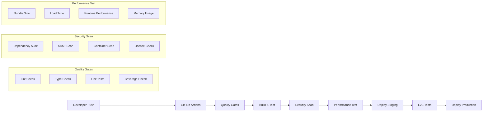

# CI/CD Pipeline - Phase 5 Deployment

## 🔄 Comprehensive CI/CD Strategy

### Pipeline Architecture Overview


## 🚀 GitHub Actions Workflows

### Main CI/CD Pipeline
```yaml
# .github/workflows/ci-cd.yml
name: CI/CD Pipeline

on:
  push:
    branches: [main, develop]
    tags: ['v*']
  pull_request:
    branches: [main, develop]

env:
  NODE_VERSION: '18'
  REGISTRY: ghcr.io
  IMAGE_NAME: ${{ github.repository }}

jobs:
  quality-gates:
    name: Quality Gates
    runs-on: ubuntu-latest
    timeout-minutes: 15
    
    steps:
      - name: Checkout repository
        uses: actions/checkout@v4
        with:
          fetch-depth: 0
      
      - name: Setup Node.js
        uses: actions/setup-node@v4
        with:
          node-version: ${{ env.NODE_VERSION }}
          cache: 'npm'
          
      - name: Install dependencies
        run: npm ci --prefer-offline --no-audit
        
      - name: Lint check
        run: npm run lint
        
      - name: Type check
        run: npm run typecheck
        
      - name: Unit tests
        run: npm run test:unit -- --coverage --reporter=verbose
        
      - name: Upload coverage to Codecov
        uses: codecov/codecov-action@v3
        with:
          token: ${{ secrets.CODECOV_TOKEN }}
          files: ./coverage/lcov.info
          fail_ci_if_error: true
          
      - name: Coverage threshold check
        run: |
          COVERAGE=$(npm run test:coverage -- --reporter=json | jq '.total.lines.pct')
          if (( $(echo "$COVERAGE < 90" | bc -l) )); then
            echo "Coverage $COVERAGE% is below 90% threshold"
            exit 1
          fi
          echo "Coverage: $COVERAGE%"

  security-scan:
    name: Security Analysis
    runs-on: ubuntu-latest
    needs: quality-gates
    timeout-minutes: 10
    
    steps:
      - name: Checkout repository
        uses: actions/checkout@v4
        
      - name: Setup Node.js
        uses: actions/setup-node@v4
        with:
          node-version: ${{ env.NODE_VERSION }}
          cache: 'npm'
          
      - name: Install dependencies
        run: npm ci --prefer-offline --no-audit
        
      - name: Run security audit
        run: |
          npm audit --audit-level=moderate
          
      - name: Dependency vulnerability scan
        uses: snyk/actions/node@master
        env:
          SNYK_TOKEN: ${{ secrets.SNYK_TOKEN }}
        with:
          args: --severity-threshold=high
          
      - name: SAST with CodeQL
        uses: github/codeql-action/init@v3
        with:
          languages: javascript
          
      - name: Perform CodeQL Analysis
        uses: github/codeql-action/analyze@v3
        
      - name: License compliance check
        run: |
          npx license-checker --onlyAllow 'MIT;Apache-2.0;BSD-3-Clause;ISC;BSD-2-Clause' --excludePrivatePackages

  build-and-test:
    name: Build & Integration Tests
    runs-on: ubuntu-latest
    needs: [quality-gates, security-scan]
    timeout-minutes: 20
    
    strategy:
      matrix:
        node-version: [18, 20]
        
    steps:
      - name: Checkout repository
        uses: actions/checkout@v4
        
      - name: Setup Node.js ${{ matrix.node-version }}
        uses: actions/setup-node@v4
        with:
          node-version: ${{ matrix.node-version }}
          cache: 'npm'
          
      - name: Install dependencies
        run: npm ci --prefer-offline --no-audit
        
      - name: Build application
        run: npm run build
        env:
          NODE_ENV: production
          VITE_BUILD_TARGET: production
          
      - name: Validate build output
        run: |
          # Check if dist directory exists and contains required files
          test -d dist
          test -f dist/index.html
          test -f dist/assets/*.js
          test -f dist/assets/*.css
          
      - name: Bundle size analysis
        run: |
          BUNDLE_SIZE=$(du -sk dist | cut -f1)
          echo "Bundle size: ${BUNDLE_SIZE}KB"
          if [ $BUNDLE_SIZE -gt 2048 ]; then
            echo "Bundle size ${BUNDLE_SIZE}KB exceeds 2MB limit"
            exit 1
          fi
          
      - name: Integration tests
        run: npm run test:integration
        
      - name: Upload build artifacts
        uses: actions/upload-artifact@v4
        with:
          name: build-artifacts-node-${{ matrix.node-version }}
          path: dist/
          retention-days: 7

  performance-tests:
    name: Performance Validation
    runs-on: ubuntu-latest
    needs: build-and-test
    timeout-minutes: 15
    
    steps:
      - name: Checkout repository
        uses: actions/checkout@v4
        
      - name: Setup Node.js
        uses: actions/setup-node@v4
        with:
          node-version: ${{ env.NODE_VERSION }}
          cache: 'npm'
          
      - name: Install dependencies
        run: npm ci --prefer-offline --no-audit
        
      - name: Download build artifacts
        uses: actions/download-artifact@v4
        with:
          name: build-artifacts-node-18
          path: dist/
          
      - name: Setup performance testing environment
        run: |
          # Install Chrome for Lighthouse
          wget -q -O - https://dl.google.com/linux/linux_signing_key.pub | sudo apt-key add -
          sudo sh -c 'echo "deb [arch=amd64] http://dl.google.com/linux/chrome/deb/ stable main" >> /etc/apt/sources.list.d/google-chrome.list'
          sudo apt-get update
          sudo apt-get install -y google-chrome-stable
          
      - name: Lighthouse performance audit
        run: |
          npx lighthouse-ci autorun --config=.lighthouserc.json
        env:
          LHCI_GITHUB_APP_TOKEN: ${{ secrets.LHCI_GITHUB_APP_TOKEN }}
          
      - name: Runtime performance tests
        run: npm run test:performance
        
      - name: Memory usage validation
        run: |
          # Run memory stress tests
          npm run test:memory -- --max-memory=512MB
          
      - name: Upload performance reports
        uses: actions/upload-artifact@v4
        with:
          name: performance-reports
          path: performance-reports/

  e2e-tests:
    name: End-to-End Tests
    runs-on: ubuntu-latest
    needs: build-and-test
    timeout-minutes: 20
    
    steps:
      - name: Checkout repository
        uses: actions/checkout@v4
        
      - name: Setup Node.js
        uses: actions/setup-node@v4
        with:
          node-version: ${{ env.NODE_VERSION }}
          cache: 'npm'
          
      - name: Install dependencies
        run: npm ci --prefer-offline --no-audit
        
      - name: Download build artifacts
        uses: actions/download-artifact@v4
        with:
          name: build-artifacts-node-18
          path: dist/
          
      - name: Start preview server
        run: |
          npm run preview &
          npx wait-on http://localhost:4173 --timeout 60000
          
      - name: Run E2E tests
        uses: cypress-io/github-action@v6
        with:
          start: npm run preview
          wait-on: 'http://localhost:4173'
          wait-on-timeout: 120
          record: true
          parallel: true
        env:
          CYPRESS_RECORD_KEY: ${{ secrets.CYPRESS_RECORD_KEY }}
          GITHUB_TOKEN: ${{ secrets.GITHUB_TOKEN }}
          
      - name: Upload E2E artifacts
        uses: actions/upload-artifact@v4
        if: failure()
        with:
          name: cypress-artifacts
          path: |
            cypress/screenshots
            cypress/videos

  docker-build:
    name: Docker Build & Push
    runs-on: ubuntu-latest
    needs: [quality-gates, security-scan, build-and-test]
    if: github.event_name == 'push' && (github.ref == 'refs/heads/main' || startsWith(github.ref, 'refs/tags/'))
    timeout-minutes: 15
    
    permissions:
      contents: read
      packages: write
      
    steps:
      - name: Checkout repository
        uses: actions/checkout@v4
        
      - name: Set up Docker Buildx
        uses: docker/setup-buildx-action@v3
        
      - name: Log in to Container Registry
        uses: docker/login-action@v3
        with:
          registry: ${{ env.REGISTRY }}
          username: ${{ github.actor }}
          password: ${{ secrets.GITHUB_TOKEN }}
          
      - name: Extract metadata
        id: meta
        uses: docker/metadata-action@v5
        with:
          images: ${{ env.REGISTRY }}/${{ env.IMAGE_NAME }}
          tags: |
            type=ref,event=branch
            type=ref,event=pr
            type=semver,pattern={{version}}
            type=semver,pattern={{major}}.{{minor}}
            type=sha,prefix={{branch}}-
            
      - name: Build and push Docker image
        uses: docker/build-push-action@v5
        with:
          context: .
          push: true
          tags: ${{ steps.meta.outputs.tags }}
          labels: ${{ steps.meta.outputs.labels }}
          cache-from: type=gha
          cache-to: type=gha,mode=max
          platforms: linux/amd64,linux/arm64
          build-args: |
            BUILD_VERSION=${{ github.ref_name }}
            BUILD_SHA=${{ github.sha }}
            BUILD_DATE=${{ github.event.head_commit.timestamp }}

  deploy-staging:
    name: Deploy to Staging
    runs-on: ubuntu-latest
    needs: [performance-tests, e2e-tests, docker-build]
    if: github.ref == 'refs/heads/main'
    environment: staging
    timeout-minutes: 10
    
    steps:
      - name: Checkout repository
        uses: actions/checkout@v4
        
      - name: Configure kubectl
        run: |
          echo "${{ secrets.KUBECONFIG_STAGING }}" | base64 -d > kubeconfig
          export KUBECONFIG=kubeconfig
          
      - name: Deploy to staging cluster
        run: |
          export KUBECONFIG=kubeconfig
          envsubst < k8s/staging.yaml | kubectl apply -f -
        env:
          IMAGE_TAG: ${{ github.sha }}
          NAMESPACE: pose-detection-staging
          
      - name: Wait for deployment
        run: |
          export KUBECONFIG=kubeconfig
          kubectl rollout status deployment/pose-detection -n pose-detection-staging --timeout=300s
          
      - name: Run smoke tests
        run: |
          STAGING_URL="https://staging.pose-detection.example.com"
          npx wait-on $STAGING_URL --timeout 60000
          curl -f $STAGING_URL/health || exit 1

  deploy-production:
    name: Deploy to Production
    runs-on: ubuntu-latest
    needs: deploy-staging
    if: startsWith(github.ref, 'refs/tags/v')
    environment: production
    timeout-minutes: 15
    
    steps:
      - name: Checkout repository
        uses: actions/checkout@v4
        
      - name: Configure kubectl
        run: |
          echo "${{ secrets.KUBECONFIG_PRODUCTION }}" | base64 -d > kubeconfig
          export KUBECONFIG=kubeconfig
          
      - name: Blue-Green deployment
        run: |
          export KUBECONFIG=kubeconfig
          ./scripts/blue-green-deploy.sh
        env:
          IMAGE_TAG: ${{ github.ref_name }}
          NAMESPACE: pose-detection-production
          
      - name: Validate production deployment
        run: |
          PROD_URL="https://pose-detection.example.com"
          npx wait-on $PROD_URL --timeout 120000
          
          # Run production health checks
          curl -f $PROD_URL/health || exit 1
          curl -f $PROD_URL/ready || exit 1
          
      - name: Create GitHub release
        uses: softprops/action-gh-release@v1
        with:
          generate_release_notes: true
          files: |
            dist/assets/*.js
            dist/assets/*.css
        env:
          GITHUB_TOKEN: ${{ secrets.GITHUB_TOKEN }}

  notify:
    name: Notification
    runs-on: ubuntu-latest
    needs: [deploy-staging, deploy-production]
    if: always()
    
    steps:
      - name: Slack notification
        uses: 8398a7/action-slack@v3
        with:
          status: ${{ job.status }}
          channel: '#deployments'
          webhook_url: ${{ secrets.SLACK_WEBHOOK }}
```

### Quality Gates Configuration

#### Lighthouse CI Configuration
```json
// .lighthouserc.json
{
  "ci": {
    "collect": {
      "startServerCommand": "npm run preview",
      "url": ["http://localhost:4173"],
      "numberOfRuns": 3
    },
    "upload": {
      "target": "filesystem",
      "outputDir": "./performance-reports"
    },
    "assert": {
      "assertions": {
        "categories:performance": ["error", {"minScore": 0.9}],
        "categories:accessibility": ["error", {"minScore": 0.9}],
        "categories:best-practices": ["error", {"minScore": 0.9}],
        "categories:seo": ["error", {"minScore": 0.8}],
        "first-contentful-paint": ["error", {"maxNumericValue": 2000}],
        "largest-contentful-paint": ["error", {"maxNumericValue": 3000}],
        "cumulative-layout-shift": ["error", {"maxNumericValue": 0.1}],
        "total-blocking-time": ["error", {"maxNumericValue": 300}]
      }
    }
  }
}
```

#### Bundle Analysis Configuration
```javascript
// bundle-analyzer.config.js
module.exports = {
  budgets: [
    {
      type: 'initial',
      maximumWarning: '1mb',
      maximumError: '2mb'
    },
    {
      type: 'anyComponentStyle',
      maximumWarning: '100kb',
      maximumError: '200kb'
    },
    {
      type: 'bundle',
      name: 'main',
      maximumWarning: '800kb',
      maximumError: '1.5mb'
    },
    {
      type: 'bundle',
      name: 'vendor',
      maximumWarning: '1.5mb',
      maximumError: '2mb'
    }
  ],
  thresholds: {
    'unused-code': 5, // Maximum 5% unused code
    'duplicate-code': 3, // Maximum 3% duplicate code
    'tree-shaking-efficiency': 95 // Minimum 95% tree-shaking efficiency
  }
};
```

## 🔧 Advanced Pipeline Features

### Matrix Testing Strategy
```yaml
# Advanced matrix testing for comprehensive coverage
jobs:
  cross-platform-tests:
    name: Cross-Platform Testing
    runs-on: ${{ matrix.os }}
    
    strategy:
      fail-fast: false
      matrix:
        os: [ubuntu-latest, windows-latest, macos-latest]
        node-version: [18, 20]
        browser: [chrome, firefox, safari, edge]
        exclude:
          - os: ubuntu-latest
            browser: safari
          - os: ubuntu-latest
            browser: edge
          - os: windows-latest
            browser: safari
          - os: macos-latest
            browser: edge
            
    steps:
      - name: Checkout repository
        uses: actions/checkout@v4
        
      - name: Setup Node.js ${{ matrix.node-version }}
        uses: actions/setup-node@v4
        with:
          node-version: ${{ matrix.node-version }}
          
      - name: Install dependencies
        run: npm ci
        
      - name: Run browser-specific tests
        run: npm run test:browser -- --browser=${{ matrix.browser }}
        env:
          TEST_BROWSER: ${{ matrix.browser }}
          
      - name: Performance benchmark
        run: npm run benchmark -- --platform=${{ matrix.os }}
```

### Deployment Strategies

#### Blue-Green Deployment Script
```bash
#!/bin/bash
# scripts/blue-green-deploy.sh
set -euo pipefail

NAMESPACE=${NAMESPACE:-"pose-detection-production"}
IMAGE_TAG=${IMAGE_TAG:-"latest"}
CURRENT_COLOR=""
NEW_COLOR=""

# Determine current active color
get_current_color() {
    CURRENT_COLOR=$(kubectl get service pose-detection-service -n $NAMESPACE -o jsonpath='{.spec.selector.color}' 2>/dev/null || echo "blue")
    
    if [ "$CURRENT_COLOR" = "blue" ]; then
        NEW_COLOR="green"
    else
        NEW_COLOR="blue"
    fi
    
    echo "Current color: $CURRENT_COLOR"
    echo "Deploying to: $NEW_COLOR"
}

# Deploy new version
deploy_new_version() {
    echo "Deploying new version to $NEW_COLOR environment..."
    
    envsubst < k8s/production-$NEW_COLOR.yaml | kubectl apply -f -
    
    # Wait for deployment to be ready
    echo "Waiting for $NEW_COLOR deployment to be ready..."
    kubectl rollout status deployment/pose-detection-$NEW_COLOR -n $NAMESPACE --timeout=600s
    
    # Health check
    echo "Running health checks on $NEW_COLOR environment..."
    HEALTH_URL="http://pose-detection-$NEW_COLOR-service.$NAMESPACE.svc.cluster.local/health"
    
    for i in {1..30}; do
        if kubectl run health-check-$NEW_COLOR --rm -i --restart=Never --image=curlimages/curl -- curl -f $HEALTH_URL; then
            echo "Health check passed"
            break
        fi
        
        if [ $i -eq 30 ]; then
            echo "Health check failed after 30 attempts"
            exit 1
        fi
        
        sleep 10
    done
}

# Switch traffic
switch_traffic() {
    echo "Switching traffic to $NEW_COLOR environment..."
    
    kubectl patch service pose-detection-service -n $NAMESPACE -p '{"spec":{"selector":{"color":"'$NEW_COLOR'"}}}'
    
    echo "Traffic switched to $NEW_COLOR"
    
    # Wait for a few minutes before cleaning up old deployment
    echo "Waiting 5 minutes before cleaning up old deployment..."
    sleep 300
}

# Cleanup old deployment
cleanup_old_deployment() {
    echo "Cleaning up $CURRENT_COLOR deployment..."
    
    kubectl delete deployment pose-detection-$CURRENT_COLOR -n $NAMESPACE --ignore-not-found=true
    
    echo "Cleanup completed"
}

# Rollback function
rollback() {
    echo "Rolling back to $CURRENT_COLOR environment..."
    
    kubectl patch service pose-detection-service -n $NAMESPACE -p '{"spec":{"selector":{"color":"'$CURRENT_COLOR'"}}}'
    
    # Clean up failed deployment
    kubectl delete deployment pose-detection-$NEW_COLOR -n $NAMESPACE --ignore-not-found=true
    
    echo "Rollback completed"
    exit 1
}

# Set trap for rollback on failure
trap rollback ERR

# Main deployment flow
main() {
    get_current_color
    deploy_new_version
    switch_traffic
    cleanup_old_deployment
    
    echo "Blue-Green deployment completed successfully!"
}

main "$@"
```

#### Canary Deployment Configuration
```yaml
# k8s/canary-deployment.yaml
apiVersion: argoproj.io/v1alpha1
kind: Rollout
metadata:
  name: pose-detection-canary
  namespace: pose-detection-production
spec:
  replicas: 6
  strategy:
    canary:
      maxSurge: "25%"
      maxUnavailable: 0
      steps:
      - setWeight: 10
      - pause:
          duration: 2m
      - setWeight: 20
      - pause:
          duration: 2m
      - setWeight: 40
      - pause:
          duration: 2m
      - setWeight: 60
      - pause:
          duration: 2m
      - setWeight: 80
      - pause:
          duration: 2m
      analysis:
        templates:
        - templateName: success-rate
        - templateName: latency
        args:
        - name: service-name
          value: pose-detection-service
      trafficRouting:
        nginx:
          stableService: pose-detection-stable
          canaryService: pose-detection-canary
          additionalIngressAnnotations:
            canary-by-header: "X-Canary"
  selector:
    matchLabels:
      app: pose-detection
  template:
    metadata:
      labels:
        app: pose-detection
    spec:
      containers:
      - name: pose-detection
        image: ghcr.io/organization/pose-detection:${IMAGE_TAG}
        ports:
        - containerPort: 80
        env:
        - name: NODE_ENV
          value: "production"
        resources:
          requests:
            memory: "256Mi"
            cpu: "250m"
          limits:
            memory: "512Mi"
            cpu: "500m"
        livenessProbe:
          httpGet:
            path: /health
            port: 80
          initialDelaySeconds: 30
          periodSeconds: 10
        readinessProbe:
          httpGet:
            path: /ready
            port: 80
          initialDelaySeconds: 5
          periodSeconds: 5
```

### Monitoring and Observability Integration

#### Deployment Monitoring
```yaml
# .github/workflows/deployment-monitoring.yml
name: Deployment Monitoring

on:
  deployment_status:

jobs:
  monitor-deployment:
    if: github.event.deployment_status.state == 'success'
    runs-on: ubuntu-latest
    
    steps:
      - name: Setup monitoring
        run: |
          # Install monitoring tools
          curl -LO https://github.com/prometheus/prometheus/releases/download/v2.45.0/prometheus-2.45.0.linux-amd64.tar.gz
          tar xf prometheus-2.45.0.linux-amd64.tar.gz
          
      - name: Deployment health check
        run: |
          DEPLOYMENT_URL="${{ github.event.deployment.environment_url }}"
          
          # Wait for deployment to be accessible
          timeout 300 bash -c 'until curl -f $DEPLOYMENT_URL/health; do sleep 5; done'
          
          # Run comprehensive health checks
          curl -f $DEPLOYMENT_URL/health
          curl -f $DEPLOYMENT_URL/ready
          curl -f $DEPLOYMENT_URL/metrics
          
      - name: Performance validation
        run: |
          # Run Lighthouse audit on deployed environment
          npx lighthouse ${{ github.event.deployment.environment_url }} \
            --only-categories=performance \
            --budget-path=.lighthouserc.json \
            --output=json \
            --output-path=lighthouse-results.json
            
          # Validate performance meets thresholds
          PERF_SCORE=$(jq '.categories.performance.score' lighthouse-results.json)
          if (( $(echo "$PERF_SCORE < 0.9" | bc -l) )); then
            echo "Performance score $PERF_SCORE is below 0.9 threshold"
            curl -X POST ${{ secrets.SLACK_WEBHOOK }} \
              -d '{"text":"❌ Deployment performance degradation detected"}'
            exit 1
          fi
          
      - name: Notify success
        run: |
          curl -X POST ${{ secrets.SLACK_WEBHOOK }} \
            -d '{"text":"✅ Deployment to ${{ github.event.deployment.environment }} successful"}'
```

This comprehensive CI/CD pipeline ensures robust, secure, and performant deployments with extensive quality gates and monitoring capabilities.